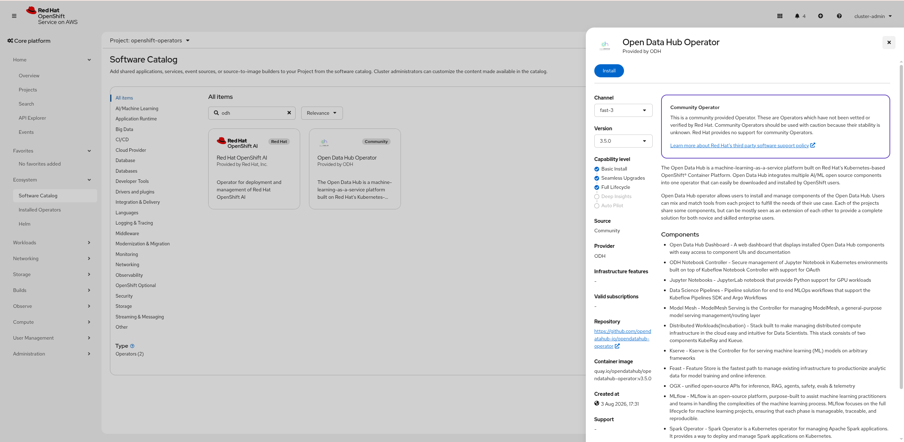

# Installing OGX on RHOAI 3.5 with Helm (from OGX Showroom)

OGX brings a unified, OpenAI-compatible AI platform - inference, embeddings,
RAG, and agents - to your OpenShift cluster. This post walks through installing
OGX and its supporting infrastructure using Helm charts.

This guide is specific to **Open Data Hub (ODH) / Red Hat OpenShift AI (RHOAI) 3.5**,
which we assume is already installed and running on your cluster. If you still
need to install it, add the ODH or RHOAI 3.5 operator from the OpenShift software
catalog first, then come back here. Details on installing the operator and
creating the `DataScienceCluster` are in the RHOAI docs:
https://docs.redhat.com/en/documentation/red_hat_openshift_ai_self-managed



## What you get

Two Helm charts do the work:

- **ogx-infra** - the supporting infrastructure: PostgreSQL, Milvus, Keycloak,
  MinIO, and etcd. Sensible defaults mean you usually don't touch it.
- **ogx-rhoai** - the OGX server itself, deployed as an `OGXServer` custom
  resource, plus an OpenShift Route and NetworkPolicy.

Everything lands in a namespace you create (this guide uses `ogx-ns`).

## Prerequisites

- An OpenShift cluster with **ODH/RHOAI 3.5** installed with the
  `DataScienceCluster` and `DSCInitialization` in a `Ready` state.
  - The `DataScienceCluster` must have its OGX component set to
    `managementState: Managed`.
- `oc` logged in to the cluster.
- `helm` 3.x installed.
- VLLM inference and embedding endpoints you can reach, each with an API token.

## Step 1: Configure your endpoints

The infra chart needs no values file. The OGX server chart needs to know where
your VLLM endpoints live. Create a `values.yaml`:

```yaml
ogx:
  inference:
    model: llama-3-2-3b
    vllmUrl: "https://your-vllm-inference-endpoint/v1"
    vllmApiToken: "your-inference-token"
  embedding:
    model: nomic-embed-text-v1.5
    vllmUrl: "https://your-vllm-embedding-endpoint/v1"
    vllmApiToken: "your-embedding-token"
  # Optional, only if you want to use OpenAI models
  openaiApiKey: ""
```

## Step 2: Install

Install the infrastructure first, then the OGX server:

```bash
NS=ogx-ns
oc create namespace $NS

# 1. Infrastructure (postgres, milvus, keycloak, minio, etcd)
helm upgrade --install ogx-infra \
  oci://quay.io/opendatahub/ogx-showroom-infra \
  --version 0.0.0-main -n $NS --wait --timeout 10m

# 2. OGX server (OGXServer CR, Route, NetworkPolicy)
helm upgrade --install ogx-rhoai \
  oci://quay.io/opendatahub/ogx-showroom-rhoai \
  --version 0.0.0-main -n $NS -f values.yaml --wait --timeout 1m
```

The infra install can take several minutes as the databases and vector store
come up. The `--wait` flag holds until everything is ready.

Confirm the OGX server and its supporting pods are running before testing:

```bash
oc get ogxserver -n $NS
oc get pods -n $NS
```

Wait until the `OGXServer` reports ready and the pods are `Running`.

## Step 3: Test it

In this demo OGX authenticates through Keycloak (realm `ogx-demo`, client `ogx`). Grab a
token and send a chat completion request to confirm the server is live:

```bash
OGX_URL=$(oc get route ogx-distribution -n $NS -o jsonpath='{.spec.host}')
KEYCLOAK_HOST=$(oc get route keycloak -n $NS -o jsonpath='{.spec.host}')
CLIENT_SECRET=$(oc get secret keycloak-secret -n $NS -o jsonpath='{.data.KEYCLOAK_CLIENT_SECRET}' | base64 -d)
USER_PASSWORD=$(oc get secret keycloak-secret -n $NS -o jsonpath='{.data.KEYCLOAK_USER_PASSWORD}' | base64 -d)

TOKEN=$(curl -s "https://${KEYCLOAK_HOST}/realms/ogx-demo/protocol/openid-connect/token" \
  -d "grant_type=password&client_id=ogx&client_secret=${CLIENT_SECRET}&username=user&password=${USER_PASSWORD}" \
  | jq -r .access_token)

curl -s "https://${OGX_URL}/v1/chat/completions" \
  -H "Authorization: Bearer $TOKEN" \
  -H "Content-Type: application/json" \
  -d '{"model": "vllm-inference/llama-3-2-3b", "messages": [{"role": "user", "content": "Say hello in 5 words"}]}' \
  | jq .choices[0].message.content
```

The model is prefixed with the provider (`vllm-inference/`) and must match the
model you configured in `values.yaml` (whatever your vLLM endpoint serves).

Output:

```
"Hello, how are you?"
```

A short greeting in the response means OGX is serving requests through the
full auth and inference path. Because the endpoint is OpenAI-compatible, you can
point the OpenAI SDK (or any compatible client) at `OGX_URL` with the same
bearer token.

## Uninstall

```bash
helm uninstall ogx-rhoai -n $NS
helm uninstall ogx-infra -n $NS
```

Secrets are preserved by default so a reinstall won't lose your data. To fully
clean up:

```bash
oc delete secret keycloak-db-secret keycloak-secret minio-secret \
  postgres-secret grafana-secret -n $NS
```

## Wrapping up

With two `helm` commands you have a complete OGX stack - inference, embeddings,
a vector store, OAuth2 auth, and object storage - running on ODH/RHOAI 3.5. From
here, explore the demo suite in the OGX Showroom repo to build RAG pipelines,
agents, and more against your new endpoint.
